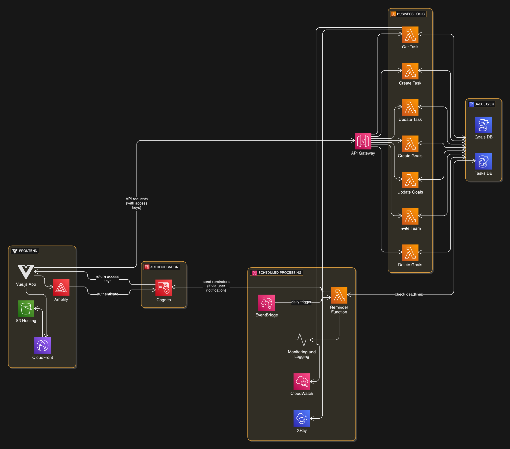
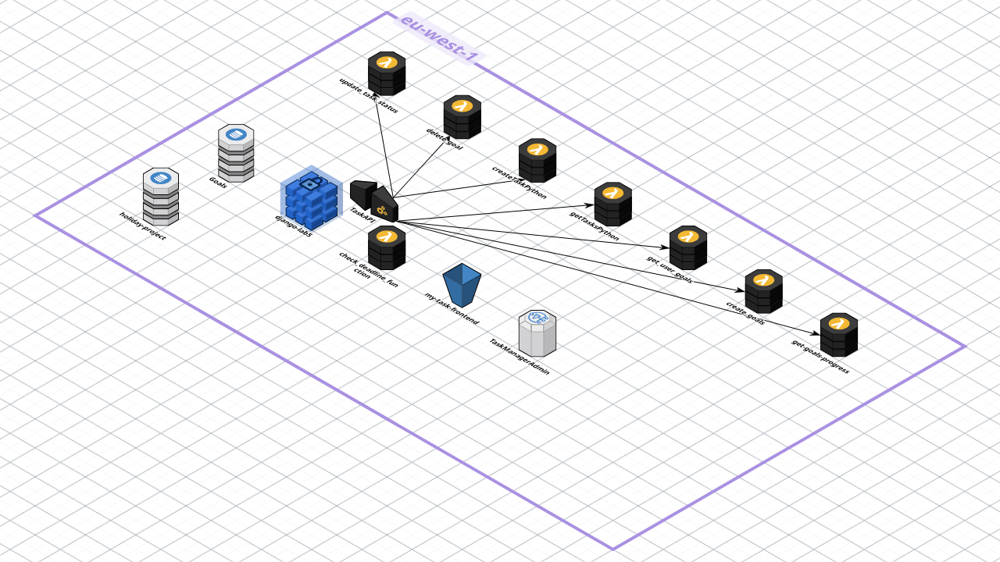
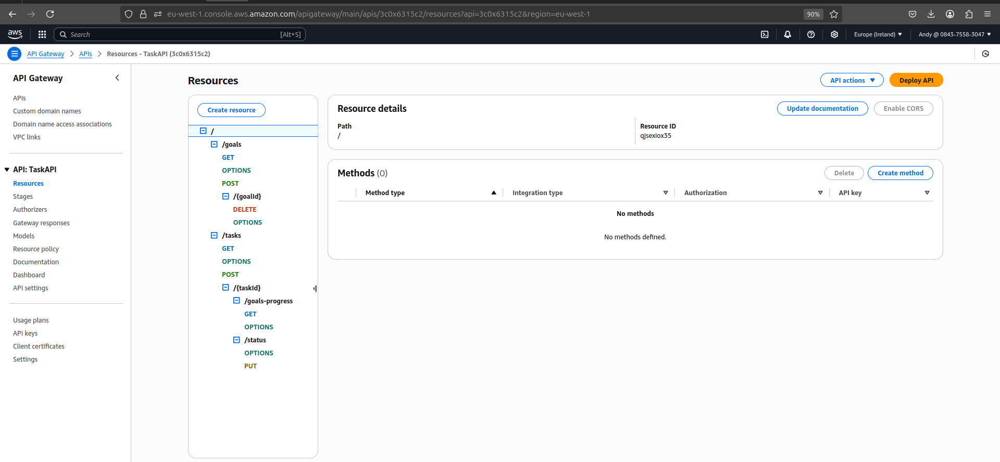
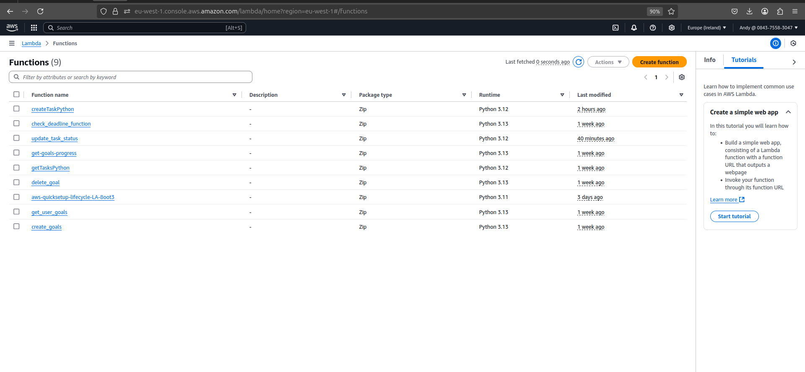

# Backend Documentation for Task Management System

## Overview
The backend of the Task Management System is a serverless AWS architecture that supports task allocation, goal setting, and progress tracking for teams. It integrates with a Vue.js frontend hosted on S3 with CloudFront, using Amplify for authentication, Lambda for logic, DynamoDB for storage, API Gateway for REST endpoints, and Cognito for user authentication. The backend provides APIs for task and goal management, enforces role-based access (admins vs. team members), and sends email notifications for task updates and deadlines.

This documentation outlines the backend components, including Lambda functions, API Gateway endpoints, DynamoDB tables, and security considerations, with placeholders for three assumed functions.NOTE: These functions were built for cloud native architecture, modifying it to run on local environment is not in the scope of this documentation.

## 📚 Resources Table

| Stack            | Description                                                                 | GitHub Link(s)                                                                        |
|------------------|-----------------------------------------------------------------------------|--------------------------------------------------------------------------------------|
| **API DOCUMENTATION URL**      | Real time api documentation with swagger | [Swagger-ui](https://app.swaggerhub.com/apis-docs/amalitech-8db/Task_Manager/1.0)|
| **Frontend**     | Built with Vue.js, using AWS Amplify for authentication integration.        | [Task Manager Backend](https://github.com/guderian120/task_manager_project_frontend)                                                                           |
| **Live Application** | Explore the live application here                                        | [Task Manager](https://dangf6yk5kpeq.cloudfront.net/)    

## Backend Architecture
The backend uses the following AWS services:

| Component          | Technology/Service       | Description                                                  |
|--------------------|-------------------------|--------------------------------------------------------------|
| **Compute**        | AWS Lambda              | Runs business logic for tasks, goals, and notifications.     |
| **Storage**        | Amazon DynamoDB         | Stores tasks and goals in NoSQL tables.                      |
| **API**            | Amazon API Gateway      | Exposes REST endpoints with Cognito authentication.          |
| **Authentication** | AWS Cognito             | Manages user authentication with admin/team member roles.    |
| **Notifications**  | Gmail SMTP (via Lambda) | Sends email reminders and status updates.                    |
| **Orchestration**  | CloudWatch Events       | Schedules tasks (e.g., deadline reminders).                  |

## Backend Architecture Images

### Deployment
- Lambda functions are deployed via AWS SAM or manually.
- API Gateway uses Lambda proxy integration with Cognito authorizers.
- Environment variables (`TASKS_TABLE`, `GOALS_TABLE`, `GMAIL_USER`, `GMAIL_PASSWORD`, `ADMIN_EMAIL`) are configured in Lambda.

## API Gateway Endpoints
The backend exposes these REST endpoints, all supporting CORS:

| Endpoint                        | Method | Lambda Function         | Description                                          |
|---------------------------------|--------|-------------------------|------------------------------------------------------|
| `/goals`                        | POST   | `create_goal.py`        | Create or update a goal (team members).              |
| `/goals`                        | GET    | (Not provided)          | Retrieve all goals (assumed).                        |
| `/goals/{goalId}`               | DELETE | (Not provided)          | Delete a goal (assumed).                             |
| `/tasks`                        | GET    | `get_task.py`           | Get all tasks (admins) or assigned tasks (users).    |
| `/tasks`                        | POST   | (Not provided)          | Create a new task (assumed).                         |
| `/tasks/{taskId}/goals-progress`| GET    | `get_goal_progress.py`  | Get goals for a task (admins only).                  |
| `/tasks/{taskId}/status`        | PUT    | `update_task.py`        | Update task status and notify assignees.             |

- **OPTIONS**: Supported for CORS preflight.
- **Authorization**: Cognito JWT tokens required, with role-based access enforced in Lambda logic.

## DynamoDB Tables
Two DynamoDB tables are used, inferred from function logic:

### Tasks Table (`TASKS_TABLE`)
Stores tasks created by admins.

| Attribute       | Type   | Description                                   |
|-----------------|--------|-----------------------------------------------|
| `taskId`        | String | Primary key, unique task ID.                  |
| `title`         | String | Task title.                                   |
| `status`        | String | Status (`pending`, `in-progress`, `completed`, `overdue`). |
| `assignedTo`    | List   | List of assignee emails.                      |
| `deadline`      | String | Due date (ISO format).                        |
| `createdBy`     | String | Email of task creator (admin).                |

### Goals Table (`GOALS_TABLE`)
Stores goals set by team members.

| Attribute       | Type   | Description                                   |
|-----------------|--------|-----------------------------------------------|
| `goalId`        | String | Primary key, unique goal ID.                  |
| `title`         | String | Goal title.                                   |
| `description`   | String | Goal description.                             |
| `dueDate`       | String | Deadline (ISO format).                        |
| `taskId`        | String | Associated task ID.                           |
| `userId`        | String | Cognito sub of goal creator.                  |
| `userEmail`     | String | Email of goal creator.                        |
| `assignee`      | String | Assignee email (task creator or user).        |
| `progress`      | Number | Progress percentage (0-100).                  |
| `createdAt`     | String | Creation timestamp (ISO format).              |

**Note**: Schemas are inferred. Provide actual schemas for accuracy.

## Lambda Functions
Brief descriptions of lambda functions:

1. **Send Task Reminder (`send_task_reminder.py`)**
   - Scans `TASKS_TABLE` for tasks due within 3 days and emails assignees via Gmail SMTP.
   - Triggered by Events Bridge (e.g., daily).
   - Uses `TASKS_TABLE`, `GMAIL_USER`, `GMAIL_PASSWORD`.

2. **Create Goal (`create_goal.py`)**
   - Creates or updates goals in `GOALS_TABLE` for team members, linking to tasks.
   - Endpoint: `/goals POST`.
   - Validates inputs and assigns task creator or user as assignee.
   - Uses `GOALS_TABLE`.

3. **Get Goal Progress (`get_goal_progress.py`)**
   - Retrieves all goals for a task from `GOALS_TABLE`, restricted to admins.
   - Endpoint: `/tasks/{taskId}/goals-progress GET`.
   - Returns goal details (ID, title, progress, due date, assignee).
   - Uses `GOALS_TABLE`.

4. **Get Task (`get_task.py`)**
   - Fetches tasks from `TASKS_TABLE`: all tasks for admins, assigned tasks for team members.
   - Endpoint: `/tasks GET`.
   - Uses Cognito groups for role-based access.
   - Uses `TASKS_TABLE`.

5. **Update Task (`update_task.py`)**
   - Updates task status in `TASKS_TABLE` and emails assignees and admin.
   - Endpoint: `/tasks/{taskId}/status PUT`.
   - Supports statuses: `pending`, `in-progress`, `completed`, `overdue`.
   - Uses `TASKS_TABLE`, `ADMIN_EMAIL`, `GMAIL_USER`, `GMAIL_PASSWORD`.

6. **Create Task (`create_task_function.py`)**
   - Create tasks in `TASKS_TABLE`, by admin-only.
   - Endpoint: `/tasks POST`.

7. **Delete Goal (`delete_goal.py`)**
   - Delete a goal from `GOALS_TABLE` by `goalId`.
   - Endpoint: `/goals/{goalId} DELETE`.

## Security Considerations
- **Cognito Authentication**:
  - All endpoints require Cognito JWT tokens, validated by API Gateway authorizers.
  - Roles (Admin, Team Member) use `cognito:groups`.
- **IAM Permissions**:
  - Lambda roles need `dynamodb:Scan`, `dynamodb:GetItem`, `dynamodb:PutItem`, `dynamodb:UpdateItem` for tables.
  - Usage of least privilege principles.
- **Environment Variables**:
  - Store sensitive data (`GMAIL_USER`, `GMAIL_PASSWORD`, `ADMIN_EMAIL`) in Lambda environment variables, ideally with AWS KMS.
- **DynamoDB**:
  - Use partition keys (`taskId`, `goalId`) for efficiency.

## Integration with Frontend
- **Vue.js Frontend**:
  - Hosted on S3 with CloudFront, secured with Origin Access Control.
  - Uses Amplify for Cognito authentication and API calls.
- **API Calls**:
  - Frontend calls API Gateway via Amplify’s API module (e.g., `GET /tasks`).
- **Authentication**:
  - Users sign in via Cognito, with JWT tokens in API requests.
- **Notifications**:
  - Email reminders and status updates notify users outside the app.

## Setup Instructions
### Prerequisites
- AWS account with Lambda, DynamoDB, API Gateway, Cognito.
- AWS CLI, SAM CLI.
- Python 3.8+ for Lambda.
- Cognito user pool with Admin/Team Member groups.
- Gmail account with App Password.

### Deployment
1. **DynamoDB**:
   - Create `TASKS_TABLE`, `GOALS_TABLE` with inferred schemas.
   - Set environment variables in Lambda.
2. **Lambda**:
   - Package functions, deploy via SAM/Console.
   - Configure environment variables.
3. **API Gateway**:
   - Set up REST API with endpoints.
   - Enable Cognito authorizer.
   - Deploy to a stage (e.g., `prod`).
4. **Cognito**:
   - Configure user pool with groups, integrate with Amplify.
5. **Eventbridge**:
   - Schedule `send_task_reminder.py` (e.g., daily).

### Testing
- Test APIs with Postman/curl using Cognito tokens.
- Verify task creation, status updates, and notifications.
- Check DynamoDB data after API calls.

